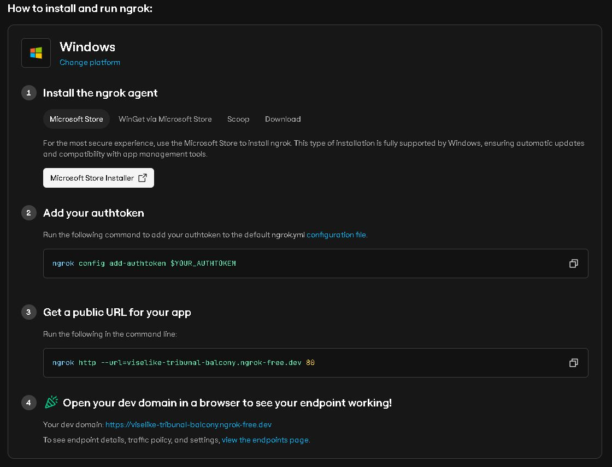

# Complete pharmacy management system

# Features

1. Products
2. Product categories
3. Purchases
4. Sales
5. Supplier
6. Reports
7. Access Control (roles and permissions)
8. Users
9. User Profile
10. Settings (Application settings)
11. Application backup
12. Dashboard
13. Stock notifications

# Installation 
Follow these steps to install the application.
1. Clone the Repository
```
git clone https://github.com/ImGsus/PharmaC.git
```
2. Go to project directory

```
cd Pharmacy-management-system
```

3. Install packages with composer

```
composer install
```

After installing PHP dependencies, create the storage symlink so uploaded files are served correctly:

```
php artisan storage:link
```

The project also runs this automatically after `composer install`/`update` via Composer scripts.

4. Install npm packages with 
```
npm install; npm run dev
```
5. Create your database 

6. Rename .env.example to .env Or copy it and paste at project root directory and name the file .env.You can also use this command.

```
cp .env.example ./.env
```
7. Generate app key with this command
```
php artisan key:generate
```

8. Set database connection to your database in the .env file.

```
DB_CONNECTION=mysql
DB_HOST=127.0.0.1
DB_PORT=3307
DB_DATABASE=pharmacy
DB_USERNAME=root
DB_PASSWORD=
```
9. Import full database sql file in the database folder, or run migrations
Use this command to run migrations

```
php artisan migrate --seed
```
10. Start the local server and browser to your app.
This command will start the development server
```
php artisan serve
```

11. Open the address in the terminal in your browser.Usually address is usually like this:
```
http://127.0.0.1:8000
```

## Prescription OCR Setup (Windows)

Prescription image analysis uses Tesseract OCR. ImageMagick is also recommended because the application uses it to preprocess and crop prescription images before OCR. Install both tools on the computer running Laravel; installing them on another computer will not make them available to the Laravel server.

### 1. Install and check the OCR tools

Install Tesseract OCR for Windows and ImageMagick. During ImageMagick setup, enable the option to add the application directory to the system PATH. If Tesseract is added to PATH by its installer, that is useful too, but the project can use its explicit executable path below.

Open **Command Prompt** and check the installations:

```cmd
tesseract --version
where tesseract
magick -version
where magick
```

Tesseract should report a version and ImageMagick should report its version. If `where tesseract` or `where magick` cannot find the program, reopen Command Prompt after installation or use the executable path in the project configuration where applicable.

### 2. Configure the project

In the project root, create or edit `.env` and set `TESSERACT_PATH` to the location of `tesseract.exe`. This is the common default installation path:

```dotenv
TESSERACT_PATH="C:\\Program Files\\Tesseract-OCR\\tesseract.exe"
IMAGEMAGICK_PATH=magick
```

If Tesseract was installed somewhere else, replace the path with the actual location. If `magick -version` does not work in Command Prompt, set `IMAGEMAGICK_PATH` to the full path of `magick.exe` instead, for example:

```dotenv
IMAGEMAGICK_PATH="C:\\Program Files\\ImageMagick-7.1.1-Q16-HDRI\\magick.exe"
```

Use the ImageMagick folder name that exists on your computer. Then, in the VS Code terminal opened at the project root, clear Laravel's cached configuration and start (or restart) the server:

```powershell
php artisan config:clear
php artisan serve
```

Keep that terminal running. If Laravel was already running when `.env` was changed, stop it with `Ctrl+C` and run `php artisan serve` again so the server process picks up the new configuration.

### 3. Analyze a prescription image

1. Open `http://127.0.0.1:8000` and sign in with an account that can access Prescription Verification.
2. Open **Prescriptions**, choose a JPG, JPEG, PNG, or WebP image up to 5 MB, then select **Analyze Image**.
3. Choose **Built-in OCR** to analyze offline with Tesseract, or select **AI Cloud → Google Gemini** for online image analysis using the `gemini-3.8-flash` model. Create a named Gemini profile once; its key is encrypted in the database and scoped to your signed-in account. Selecting that profile starts analysis, and **Remove** deletes an old profile. The app never sends the saved key back to the browser. Keep `APP_KEY` backed up and stable; if it changes, recreate saved Gemini profiles. Gemini sends the prescription image to Google for processing. Google may use free-tier data to improve its products, so do not send identifiable patient information unless your privacy, consent, and regulatory requirements allow it. Free-tier availability and request limits depend on the Google project and can change; check AI Studio’s Usage and Rate Limit pages.
4. Review and correct the draft against the original image. Built-in OCR compares alternate image rotations when ImageMagick is available. Full-page and regional scans are merged, word highlights use the selected image orientation, and text that cannot be mapped to a known field is placed in the Rx draft for manual review. Use **Recheck catalog** to search corrected text against active products.

Analysis results are suggestions only. Tesseract or Gemini can misread low-resolution, skewed, handwritten, shadowed, or compressed text. Always confirm patient details, medicine names, strengths, and directions against the original prescription before submitting or approving it. PDF files can be submitted for manual verification, but image analysis currently accepts image files only.

## Running with ngrok (Mobile/Remote Access)

To access your local pharmacy management system from a mobile device or remote location, follow these steps:



### Step 1: Update .env with ngrok URL
Update your `.env` file with your ngrok forwarding URL:
```
APP_URL=https://silencer-frostbite-sponsor.ngrok-free.dev
ASSET_URL=https://silencer-frostbite-sponsor.ngrok-free.dev
```
Replace `silencer-frostbite-sponsor` with your actual ngrok forwarding URL.

### Step 2: First Terminal - Start Laravel
Open PowerShell and run:
```powershell
cd "C:\Users\Administrator\Documents\A\Pharmacy-management-system-main"
php artisan serve --host=0.0.0.0 --port=8000
```

### Step 3: Second Terminal - Start ngrok
Open another PowerShell and run:
```powershell
cd "C:\Users\Administrator\Documents\A\Pharmacy-management-system-main"
.\ngrok\ngrok.exe http 8000
```

The terminal will display a `Forwarding` URL like:
```
Forwarding                    https://silencer-frostbite-sponsor.ngrok-free.dev -> http://localhost:8000
```

### Step 4: Access on Mobile
On your mobile device, open Chrome and navigate to:
```
https://silencer-frostbite-sponsor.ngrok-free.dev
```

To access the barcode scanner directly:
```
https://silencer-frostbite-sponsor.ngrok-free.dev/Webby/index.php
```

### Notes
- Both terminals must be running simultaneously
- Replace the URL with your actual ngrok forwarding address
- ngrok requires an internet connection
- For the barcode scanner to work, use HTTPS (as provided by ngrok)

12. Enjoy and make sure to star the repo :).Report bugs,features and also send your pull requests.

# admin login credentials

```
 email: admin@admin.com
 password: password
```

Theme: https://themeforest.net/item/doccure-doctor-appointment-booking-system-bootstrap-angular-template/28201296

# Usage

- Profile => 
	Each user has a profile of their own.
	You can update your profile credentials from this page by clicking on the edit button.
	You can also change your password by clicking on the password tab
	and choosing your new password.Also make sure you type your old password correctly

- Users => 
	list of all users in the system.
	You can add new user by clicking on the add user button on the users page.
	You can also edit user details by clicking on the edit button on the users page.
	You can easily delete a user by clicking on the delete button.
	You can export or print all the users data by clicking on the export data button dropdown.


- Access Control =>
	User roles and permissions are here.
	Every user in the system has a role and each role has some number of permissions in the system.
	You can create new roles and choose their permissions. 
	Click the add role button, and write the role name and choose some number of permissions you want 
	the user holding this role to have and submit.
	you can edit or delete roles by clicking on either the edit button or delete button.


- Suppliers =>
	The suppliers page has a list of all your product suppliers.
	You can add new suppliers by clicking on add supplier button on the page or from the sidebar.
	You can also edit supplier details by clicking on the edit button on the suppliers page.
	You can also delete by clicking on the delete button.


- Sales => 

	The sales page has list of all the sales that has ever been made on the system.
	You can add sales by clicking on the sales button on the sales page.
	You can also delete sales by clicking on the delete button.

	You can export or print the sales data by clicking on the export data dropdown menu at the top of the list
	and choosing which option you want.


- Purchases =>
	The Purchases page contains all your product purchases.This is the core part of the 
	your application products.
	you can add purchases by clicking on the add new button on the purchases page or by clicking on the add purchase button
	on the sidebar.After that, fill in the details and submit the form.
	You can edit purchases by clicking edit button on the purchases page.
	You can also delete purchase by clicking on the delete button on the purchases page.
	You can also export or print the purchases data by clicking on the export data dropdown And choose your option.

- Products =>
	The products page contains all products that you are selling.
	You can add product by clicking on the add product from the sidebar or add new button the products page.

	You can edit the product details by clicking on the edit button on the products page
	Or you can also delete product by clicking on the delete button on the products page.

	->Outstock =>This page contains all products that are out of stock.That is when a purchased product quantity is zero and is not updated,
		It is refered to as outstocked product.
		You don't need to add or delete outstocked products.
		The system automatically recognize outstocked products and put the there
		You also export or print them too.

	->Expired =>This page  contains all products that are expired.That is products whose expiry date has reach.
		The system automatically recognize them and put them there so you don't have to add them yourself.


- Categories => 
	The categories page contains your products categories.
	You can add product category by clicking on the add category button on the categories page.
	You can also edit by clicking on the edit button on the categories page.
	You can delete categories by clicking on the delete button.


# How to add product and sell It

1 First add the category of product

2 Add the product supplier

3. Make a purchase of the product by adding purchase.

4. After purchase is made, add the product to your products.

5. You can start selling the product.

6. When you are notified of the stock, just update the purchased product quantity.
Or make a new purchase.


<p align="center"><a href="https://laravel.com" target="_blank"></a></p>

<p align="center">
@@ -242,6 +44,9 @@ We would like to extend our thanks to the following sponsors for funding Laravel
- **[DevSquad](https://devsquad.com)**
- **[Curotec](https://www.curotec.com/services/technologies/laravel/)**
- **[OP.GG](https://op.gg)**
- **[CMS Max](https://www.cmsmax.com/)**
- **[WebReinvent](https://webreinvent.com/?utm_source=laravel&utm_medium=github&utm_campaign=patreon-sponsors)**
- **[Lendio](https://lendio.com)**

## Contributing

Thank you for considering contributing to the Laravel framework! The contribution guide can be found in the [Laravel documentation](https://laravel.com/docs/contributions).
## Code of Conduct
In order to ensure that the Laravel community is welcoming to all, please review and abide by the [Code of Conduct](https://laravel.com/docs/contributions#code-of-conduct).
## Security Vulnerabilities
If you discover a security vulnerability within Laravel, please send an e-mail to Taylor Otwell via [taylor@laravel.com](mailto:taylor@laravel.com). All security vulnerabilities will be promptly addressed.
## License
The Laravel framework is open-sourced software licensed under the [MIT license](https://opensource.org/licenses/MIT).
